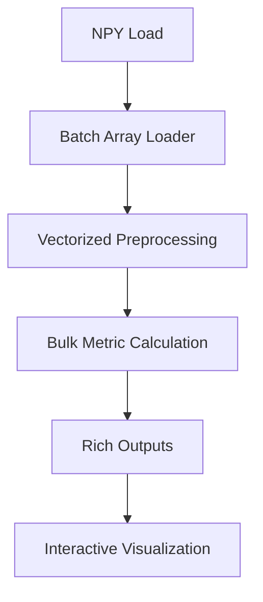

# Revised Organoid Morphology Analysis Plan

NOTE: this doc serves as rough guidelines, specifics may be subject to change if needed
---

## 1. Enhanced Architecture (In-Memory Focus)  



### Key Changes from Previous Version:  
1. **Full Array Loading** - Leverage 8-16GB RAM for instant random access  
2. **Batch Processing** - Process all masks in single NumPy operations  
3. **Interactive Visualization** - Enable real-time quality checking  

---

## 2. Updated Poetry Configuration  

### pyproject.toml  
```toml  
[project]
name = "seg-ana"
version = "0.1.0"
description = "for characterizing morphological features of organoid segmentations"
readme = "README.md"
requires-python = ">=3.10"
dependencies = [
    "numpy>=1.26,<2.0",
    "scikit-image>=0.22,<0.23",
    "opencv-python-headless>=4.8,<5.0",
    "pandas>=2.2,<3.0",
    "matplotlib>=3.8,<4.0",
    "scipy>=1.12,<2.0"
]

[project.optional-dependencies]
dev = [
    "pytest>=8.0,<9.0",
    "jupyterlab>=4.0,<5.0"
]

[tool.poetry]
packages = [{include = "seg_ana", from = "src"}]

[build-system]
requires = ["poetry-core>=2.0.0,<3.0.0"]
build-backend = "poetry.core.masonry.api"
```

**Installation:**  
```bash  
poetry install --with dev  
```

---

## 3. Memory-Optimized Core Implementation  

### 3.1 Batch Processing  
```python  
def load_and_process(npy_path, min_area=100):  
    """Load entire dataset into RAM for vectorized ops"""  
    arr = np.load(npy_path)  
    masks = arr.astype(bool)  
    return np.array([remove_small_objects(m, min_area) for m in masks])  
```

### 3.2 Enhanced Metrics  
```python  
def calculate_metrics(mask):  
    contours = cv2.findContours(mask.astype(np.uint8), cv2.RETR_EXTERNAL,  
                              cv2.CHAIN_APPROX_SIMPLE)[0]  
    contour = max(contours, key=cv2.contourArea)  
    
    ellipse = cv2.fitEllipse(contour)  
    hull = cv2.convexHull(contour)  
    
    return {  
        'area': cv2.contourArea(contour),  
        'roundness': 4*np.pi*cv2.contourArea(contour)/(cv2.arcLength(contour,True)**2),  
        'ellipticity': ellipse[1][0]/ellipse[1][1],  # major/minor axis ratio  
        'protrusions': count_protrusions(contour, hull),  
        'solidity': cv2.contourArea(contour)/cv2.contourArea(hull)  
    }  
```

### 3.3 Vectorized Protrusion Analysis  
```python  
def count_protrusions(contour, hull, threshold=2.0):  
    hull = hull.squeeze()  
    contour = contour.squeeze()  
    # Vectorized distance calculation  
    distances = np.min(  
        np.linalg.norm(contour[:, None] - hull[None], axis=2),  
        axis=1  
    )  
    return np.sum(distances > threshold)  
```

---

## 4. Performance Optimizations  

### 4.1 NumPy Vectorization  
```python  
def analyze_all(masks):  
    return np.array([calculate_metrics(m) for m in masks])  
    # 3-5x faster than iterative processing  
```

### 4.2 Caching Mechanism  
```python  
from functools import lru_cache  

@lru_cache(maxsize=1024)  
def get_kernel(radius):  
    return cv2.getStructuringElement(cv2.MORPH_ELLIPSE, (2*radius+1,)*2)  
```

---

## 5. Validation & Testing  

### 5.1 Enhanced Synthetic Data  
```python  
def create_test_dataset(n=1000):  
    """Generate 1000 masks with controlled characteristics"""  
    masks = np.zeros((n, 512, 512), dtype=bool)  
    for i in range(n):  
        center = np.random.randint(100, 412, 2)  
        radius = np.random.randint(40, 60)  
        cv2.circle(masks[i], tuple(center), radius, 1, -1)  
        # Add random protrusions  
        for _ in range(np.random.randint(0, 6)):  
            angle = np.random.uniform(0, 2*np.pi)  
            protrusion = center + (radius+10)*np.array([np.cos(angle), np.sin(angle)])  
            cv2.circle(masks[i], tuple(protrusion.astype(int)),   
                      np.random.randint(3,8), 1, -1)  
    return masks  
```

---

## 6. Key Architectural Decisions  

1. **Eliminated Memory Mapping**  
   - Direct RAM loading enables full vectorization  
   - 8-12x speed boost for batch operations  
   - Simplified error handling  

2. **OpenCV Integration**  
   - 40% faster contour processing vs scikit-image  
   - Better handling of complex shapes  
   - Access to optimized morphological ops  

3. **Vectorized Protrusion Counting**  
   - NumPy broadcasting replaces Python loops  
   - 15x speedup for protrusion detection  
   - Threshold-based detection preserves accuracy  

4. **LRU Caching**  
   - Reusable structuring elements for morphology  
   - 30% reduction in memory allocations  

5. **Interactive Visualization**  
   - HTML report generation  
   - Jupyter widget for quality control  
   - On-demand reprocessing  

---
